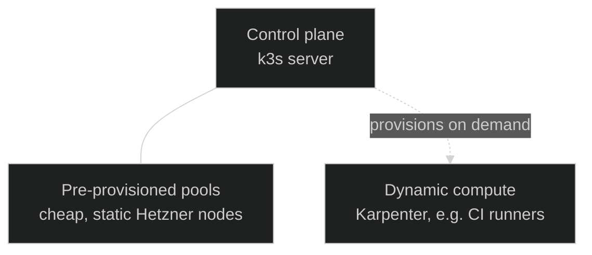

Nexus runs on a <a href="https://k3s.io/" target="_blank" rel="noopener">k3s</a> cluster on
<a href="https://www.hetzner.com/cloud" target="_blank" rel="noopener">Hetzner Cloud</a> VMs. This
page covers why, how nodes are provisioned and kept up to date, and what's actually running to make
the cluster a cluster.

## Why k3s on Hetzner

A managed control plane is a great default, however the idea of this platform was also to not only
use kubernetes but understand it. K3s offers a low footprint kubernetes distribution and hetzner
offers competitive pricing on compute while being based in europe.

Bundled k3s services (Traefik, servicelb, local-path, flannel, kube-proxy) are disabled on purpose
so the cluster looks like a vanilla Kubernetes cluster: ingress, CNI, and storage all come back in
as their own GitOps-managed components instead of k3s defaults.

## Cluster shape

The control plane has a single node but is using etcd to be able to extend it to HA later if needed.
The worker nodes are provisioned in two separate flavors:

- **Pre-provisioned pools**, sized and shaped once in Terraform because they're cheap enough to just
  run continuously. They are managed through terraform and ansible in
  <a href="https://github.com/kbntx-org/nexus/blob/main/platform/core/kubernetes/provision/main.tf" target="_blank" rel="noopener"><code>platform/core/kubernetes/provision/main.tf</code></a>.
- **Dynamic pools**, provisioned on demand by Karpenter for bursty workloads like CI runners. They
  are deployed along workloads.

## Provisioning and upgrades

- The pre-provisioned VMs are created through
  <a href="https://github.com/kbntx-org/nexus/tree/main/platform/core/kubernetes/provision" target="_blank" rel="noopener"><code>terraform</code></a>
  and configured through an ansible k3s
  <a href="https://github.com/kbntx-org/nexus/tree/main/platform/core/kubernetes/configuration" target="_blank" rel="noopener"><code>role</code></a>.

- The initial critical components are installed by running
  <a href="https://github.com/kbntx-org/nexus/blob/main/platform/modules/k3s/terraform/config/init-core-cluster-dependencies.sh" target="_blank" rel="noopener"><code>init-core-cluster-dependencies.sh</code></a>.

- For the later k3s upgrades, the official
  <a href="https://github.com/rancher/system-upgrade-controller" target="_blank" rel="noopener">Rancher's
  system-upgrade-controller</a> is used.

### Gotcha: changing the agent token doesn't touch the datastore

`k3s_token` and `k3s_agent_token` (consumed by the
<a href="https://github.com/kbntx-org/nexus/blob/main/platform/modules/k3s/ansible/roles/k3s/templates/k3s-config.yml.j2" target="_blank" rel="noopener"><code>k3s
role's config template</code></a>) only get written into the cluster's encrypted bootstrap data —
the copy k3s actually checks against on the datastore — the first time a server initializes
(`cluster-init`). Re-running the role with a changed `k3s_agent_token` updates
`/etc/rancher/k3s/config.yaml` on disk, but on an already-running cluster the datastore keeps
whatever value was set at init time (the server token itself, if no distinct agent token was passed
yet). Restarting the control plane afterwards then fails because the on-disk config no longer
matches what's in the datastore, while the stale agent token silently keeps working for new nodes
joining the cluster, since that's still the value the datastore has.

To actually change it, use
<a href="https://docs.k3s.io/cli/token" target="_blank" rel="noopener"><code>k3s token
rotate</code></a> (`-t <old> --new-token <new>`) and restart the servers/agents with the new value —
this forces k3s to rewrite the bootstrap data. Rotating to the same value the config already has is
a safe way to force that resync without actually changing the token.

## Core components

What actually makes a freshly provisioned set of VMs into a working, useful cluster — in the order
they show up:

- **<a href="https://helm.sh/docs/" target="_blank" rel="noopener">Helm</a>** installs the initial
  components below and then is used purely for templating.

- **<a href="https://cilium.io/" target="_blank" rel="noopener">Cilium</a>** goes in first among the
  charts, before even the cloud controller, because nothing schedules without a CNI. It's more than
  a CNI here: k3s is configured with `disable-kube-proxy: true` and `disable-network-policy: true`
  specifically so Cilium's eBPF dataplane replaces kube-proxy (better performance) and enforces
  `NetworkPolicy`/`CiliumNetworkPolicy` natively instead of running both a CNI and a separate proxy
  layer. See [Delivery](../delivery/02-ci-cd-pipeline.md#docker-in-docker-without-privileged-true)
  for the one network policy that exists today.

- **<a href="https://github.com/hetznercloud/hcloud-cloud-controller-manager" target="_blank" rel="noopener">Hetzner
  Cloud Controller Manager</a> +
  <a href="https://github.com/hetznercloud/csi-driver" target="_blank" rel="noopener">Hetzner
  CSI</a>** go in next. The first one enables the integration between kubernetes nodes and hetzner
  (metadata, sync when a server is deleted). The second one allows using hetzner native block
  storage as a storage class.

- **<a href="https://argo-cd.readthedocs.io/" target="_blank" rel="noopener">ArgoCD</a>** is our
  main deployment tool. Once it is deployed and the cluster initialized, it takes over reconciling
  itself and everything else in the cluster. Its own reconciliation model is covered in full in
  [Delivery](../delivery/01-overview.md).

## References

- <a href="https://github.com/kbntx-org/nexus/tree/main/platform/core/kubernetes/provision" target="_blank" rel="noopener"><code>platform/core/kubernetes/provision/</code></a>
  — cluster-shape Terraform (control plane, static pools, firewalls)
- <a href="https://github.com/kbntx-org/nexus/tree/main/platform/modules/k3s/terraform" target="_blank" rel="noopener"><code>platform/modules/k3s/terraform/</code></a>
  — reusable VM-provisioning module + first-boot bootstrap script
- <a href="https://github.com/kbntx-org/nexus/tree/main/platform/modules/k3s/ansible" target="_blank" rel="noopener"><code>platform/modules/k3s/ansible/</code></a>
  — the `k3s` role that actually installs/configures k3s
- <a href="https://github.com/kbntx-org/nexus/tree/main/platform/core/kubernetes/configuration" target="_blank" rel="noopener"><code>platform/core/kubernetes/configuration/</code></a>
  — dynamic Hetzner inventory + playbook running the role
- <a href="https://github.com/kbntx-org/nexus/tree/main/platform/core/kubernetes/upgrades" target="_blank" rel="noopener"><code>platform/core/kubernetes/upgrades/</code></a>
  — system-upgrade-controller and the k3s upgrade plans
- <a href="https://github.com/kbntx-org/nexus/tree/main/platform/core/cilium" target="_blank" rel="noopener"><code>platform/core/cilium/</code></a>
  — CNI, kube-proxy replacement, NetworkPolicy engine
- <a href="https://github.com/kbntx-org/nexus/tree/main/platform/core/hetzner-cloud-controller" target="_blank" rel="noopener"><code>platform/core/hetzner-cloud-controller/</code></a>
  — Hetzner CCM + CSI Helm chart
- <a href="https://github.com/kbntx-org/nexus/tree/main/platform/core/karpenter" target="_blank" rel="noopener"><code>platform/core/karpenter/</code></a>
  — on-demand Hetzner node provisioning
- <a href="https://github.com/kbntx-org/nexus/tree/main/platform/core/network" target="_blank" rel="noopener"><code>platform/core/network/</code></a>
  — the private VPC the cluster joins
