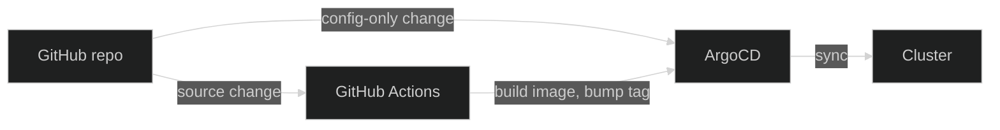

<a href="https://argo-cd.readthedocs.io/" target="_blank" rel="noopener">ArgoCD</a> is the GitOps
reconciler that owns the cluster. Every workload that runs in Nexus exists because ArgoCD read its
definition from this repo and applied it — the cluster state is a pure function of `main`. Drift is
structurally impossible (a manual `kubectl apply` gets reverted on the next reconcile), rollback is
one `git revert`, and Git history _is_ the deploy history.

## Two paths in, depending on what changed

**Config change** (a Helm value, a new manifest, a workflow tweak) — no CI involved. ArgoCD picks it
up and syncs directly. This is most of the platform: Traefik, ArgoCD itself, External Secrets, the
monitoring stack, ARC runners, and so on are all configured this way.

**Source change** — anything this repo builds an image for — goes through CI first: build the image,
then hand ArgoCD a new tag. See [CI/CD pipeline](02-ci-cd-pipeline.md) and
[GitOps deploys](03-gitops-deploys.md) for that path in full.

## The app-of-apps pattern

A single root `Application`, registered by hand once at bootstrap, points at the
<a href="https://github.com/kbntx-org/nexus/tree/main/platform/services/app-of-apps" target="_blank" rel="noopener"><code>app-of-apps</code></a>
chart — a thin wrapper around
<a href="https://github.com/argoproj/argo-helm/tree/main/charts/argocd-apps" target="_blank" rel="noopener"><code>argocd-apps</code></a>
that declares every other `Application` the platform needs as a child. Bootstrapping the platform is
one sync of the root; everything declared in
<a href="https://github.com/kbntx-org/nexus/blob/main/platform/services/app-of-apps/values.yaml" target="_blank" rel="noopener"><code>app-of-apps/values.yaml</code></a>
is then materialized on its own — every `platform/core/*` and `platform/services/*` component plus
the apps, all traceable back to one file.

**Runbook — add a new cluster-side workload:** drop the chart under `platform/core/<name>/` or
`platform/services/<name>/`, add an entry under `argocd-apps.applications` in
`app-of-apps/values.yaml`, push to `main`. No one ever clicks "create application" in the UI.

## Sync model

| Workload             | Source of truth                             | Why                                                                |
| -------------------- | ------------------------------------------- | ------------------------------------------------------------------ |
| Platform components  | This repo (single-source `Application`)     | Manifests _are_ the source of truth — converge on every Git change |
| Apps shipping images | This repo (chart) + `nexus-manifests` (tag) | Image tag is decoupled from the chart so CI can bump it atomically |

Image-shipping apps use a
<a href="https://argo-cd.readthedocs.io/en/stable/user-guide/multiple_sources/" target="_blank" rel="noopener">multi-source
<code>Application</code></a>: the chart comes from this repo, and a values overlay
(`$values/<app>/values.yaml`) comes from
<a href="https://github.com/kbntx-org/nexus-manifests" target="_blank" rel="noopener"><code>nexus-manifests</code></a>,
a small repo CI commits image-tag bumps to. A GitHub webhook triggers sub-minute sync on every
`nexus-manifests` push. Full pipeline in [GitOps deploys](03-gitops-deploys.md).

## Dependency updates

<a href="https://docs.renovatebot.com/" target="_blank" rel="noopener">Renovate</a> runs self-hosted
as a `CronJob` rather than the hosted GitHub app, so it can burst onto the same
[Karpenter](../cluster/01-overview.md)-provisioned, Cilium-isolated node shape the rest of bursty
compute in this cluster uses instead of running continuously. Its container installs
<a href="https://mise.jdx.dev/" target="_blank" rel="noopener">mise</a> at startup, fetches this
repo's own `mise.toml`, and runs `mise install` before invoking Renovate — so `postUpgradeTasks`
like the pnpm lockfile fixup run with the exact toolchain versions this repo is pinned to, not
whatever ships in the Renovate image.

## Access

Humans authenticate through GitHub SSO via the bundled
<a href="https://dexidp.io/" target="_blank" rel="noopener">Dex</a> connector — the local `admin`
account is disabled, and RBAC maps a GitHub team to `role:admin`, so granting access is a
team-membership change, not an ArgoCD config edit. CI uses a separate, narrowly-scoped API-key
account (`get`/`sync`/`update`/restart on the `default` project, nothing more).

## References

- <a href="https://github.com/kbntx-org/nexus/tree/main/platform/core/argocd" target="_blank" rel="noopener"><code>platform/core/argocd/</code></a>
  — ArgoCD Helm chart wrapper, ingress, SSO + RBAC config
- <a href="https://github.com/kbntx-org/nexus/tree/main/platform/services/app-of-apps" target="_blank" rel="noopener"><code>platform/services/app-of-apps/</code></a>
  — root chart declaring every child `Application`
- <a href="https://github.com/kbntx-org/nexus/blob/main/platform/services/app-of-apps/values.yaml" target="_blank" rel="noopener"><code>platform/services/app-of-apps/values.yaml</code></a>
  — the full catalog of cluster workloads
- <a href="https://github.com/kbntx-org/nexus/tree/main/platform/core/renovate" target="_blank" rel="noopener"><code>platform/core/renovate/</code></a>
  — self-hosted Renovate chart: `CronJob`, Karpenter node pool, Cilium egress policy
- [CI/CD pipeline](02-ci-cd-pipeline.md) — how source changes turn into images
- [GitOps deploys](03-gitops-deploys.md) — the multi-source `Application` shape and the
  `nexus-manifests` flow
